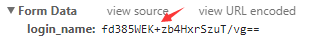
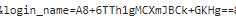

# Difficulties & Bug

### 一、ios上audio无法自动播放
>暂时没有解决方法，只能通过监听点击事件播放

### 二、h5页面唤起app，若没有app则跳转下载页面
>ios

```bash
window.location.href = link;
setTimeout(function(){
  //跳转两次可以使ios默认弹框消失
  window.location.href = downloadUrl;
  window.location.href = downloadUrl;
},2000);
```
>安卓：由于安卓是多任务，应用会进入后台，所以若使用ios的方法，则既会跳转app，也会跳转下载页面。

>原理：设置一个运行间隔20ms，总计运行100次的定时器，如果页面一直处于前台，则100次跑完，总耗时与 100x20=2000ms不会有太大差异，但页面在后台运行时，此时间会明显超过2000ms。可以利用这一点来实现是否成功打开APP检测及回调。

```bash
window.location.href = link;
var _clickTime = +(new Date());
function check(elsTime) {
    if ( elsTime > 3000 || document.hidden || document.webkitHidden) {
    } else {
        window.location.href = downloadUrl;
    }
}
//启动间隔20ms运行的定时器，并检测累计消耗时间是否超过3000ms，超过则结束
var _count = 0, intHandle;
intHandle = setInterval(function(){
    _count++;
    var elsTime = +(new Date()) - _clickTime;
    if (_count>=100 || elsTime > 3000 ) {
        clearInterval(intHandle);
        check(elsTime);
    }
}, 20);
```
### url中的加号解析出错,变成了空格

>正常情况下带加号的参数传递


>请求的url中的参数正确显示加号


>加号变成了空格导致请求失败


>原因:url中的 + 号被转义成空格了

>解决：将+号进行 `%2B` 的编码,  `replace(/\+/g, '%2B')` 
 
### overflow:scroll 在ios上滚动不流畅
`-webkit-overflow-scrolling: touch;`

### 移动端有些时候给标签绑定click事件失效
>给标签加上 ` cursor: pointer `

### vue在ios8上渲染失败


>ios8不兼容ES6的语法，需要将代码中的ES6语法全部替换。
例如： `mounted(){}`需要改写成`mounted:function(){}`

### v-cloak
>在进入页面数据未渲染完成的时候，会出现未编译的标签。v-clock这个指令可以隐藏未编译的 Mustache 标签直到实例准备完毕。
```bash
[v-cloak] {
  display: none;
}
```
```bash
<div v-cloak>
  {{ message }}
</div>
```

# knowledge
### 一、单行文本溢出显示省略号

``` bash
.ellipsis{
  overflow: hidden;
  white-space: nowrap;
  text-overflow: ellipsis;
}
```

### 二、多行文本溢出显示省略号
>WebKit浏览器或移动端的页面

``` bash
.ellipsis{
  overflow : hidden;
  text-overflow: ellipsis;
  display: -webkit-box;
  -webkit-line-clamp: 2;
  -webkit-box-orient: vertical;
}
```

# Common Code
### 获取url中的参数

```bash
function getQueryString(paramname) {
    var reg = new RegExp('(^|&)' + paramname + '=([^&]*)(&|$)', 'i');
    var r = window.location.search.substr(1).match(reg);
    if (r != null) {
        return unescape(r[2]);
    }
    return null;
}
```

### 时间戳转 yyyy-mm-dd
```bash
function formatTime(inputTime){
  var time = inputTime * 1000;
  var date = new Date(time);
  var y = date.getFullYear();
  var m = date.getMonth() + 1;
  m = m < 10 ? ('0' + m) : m;
  var d = date.getDate();
  d = d < 10 ? ('0' + d) : d;
  var h = date.getHours();
  h = h < 10 ? ('0' + h) : h;
  var minute = date.getMinutes();
  var second = date.getSeconds();
  minute = minute < 10 ? ('0' + minute) : minute;
  second = second < 10 ? ('0' + second) : second;
  return y + '-' + m + '-' + d + ' ' + h + ':' + minute + ':' + second;
}
```
### 移动端弹框滚动穿透
>出现遮罩层给 `body` 加 `modal-open`，阻止滚动穿透,取消遮罩层移除 `modal-open`

```bash
body.modal-open {
    position: fixed;
    width: 100%;
}
```
```bash
//出现遮罩层给body 加 modal-open，阻止滚动穿透
var ModalHelper = (function(bodyCls) {
var scrollTop;
return {
    afterOpen: function() {
    scrollTop = document.scrollingElement.scrollTop;
    document.body.classList.add(bodyCls);
    document.body.style.top = -scrollTop + 'px';
    },
    beforeClose: function() {
    document.body.classList.remove(bodyCls);
    // scrollTop lost after set position:fixed, restore it back.
    document.scrollingElement.scrollTop = scrollTop;
    }
};
})('modal-open');
```