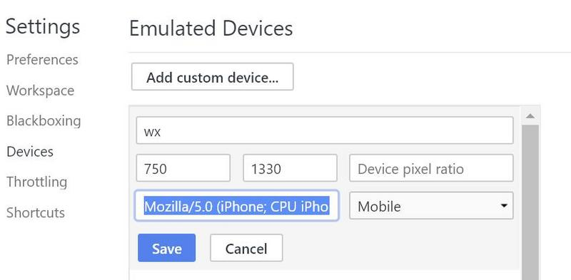

## Difficulties & Bug

### 一

>微信自定义分享的坑

```bash
分享大标题：新年福利，元旦一起嗨！疯抢市民卡50元大红包！副标题：邀好友助力，数量有限，先到先得！

当分享标题出现"红包"之类的敏感词时，会导致他人看不到分享缩略图。
```


## knowledge

### 一

>文字边框效果

```css
span {
    color: #ffdf3b;
    -webkit-text-stroke: 1px #d2aa69;   /* 边框距离 边框颜色 */
}
```

### 二

>使用`Set`数组去重:Set是一种新的数据结构，值是唯一的。判断值相等的条件与`===`一样，所以`5 !== '5'`

```js
[...new Set(array)]
```

```js
function dedupe(array) {
  return Array.from(new Set(array));
}

dedupe([1, 1, 2, 3]) // [1, 2, 3]
```

### 三

>encodeURIComponent() 函数可把字符串作为 URI 组件进行编码

>`encodeURIComponent(URIstring)`

### 四

>`document.compatMode`用来判断当前浏览器采用的渲染方式。

    * BackCompat：标准兼容模式关闭。
    * CSS1Compat：标准兼容模式开启。

```js
if(document.compatMode === 'BackCompat'){
  width = document.body.clientWidth;
} else {
  width = document.documentElement.clientWidth;
}
```
### 五

>使用扩展运算符（...）拷贝数组。

```js
// ES5
const len = items.length;
const itemsCopy = [];
let i;

for (i = 0; i < len; i++) {
  itemsCopy[i] = items[i];
}

// ES6
const itemsCopy = [...items];
```
>浏览器客户区高度、滚动条高度、滚动条的Left、滚动条的Top等等都是上面的情况。

### 六

>chrome预览微信链接



>UA设置为
```
Mozilla/5.0 (iPhone; CPU iPhone OS 8_0 like Mac OS X) AppleWebKit/600.1.4 (KHTML, like Gecko) Mobile/12A365 MicroMessenger/5.4.1 NetType/WIFI
```

## Common Code